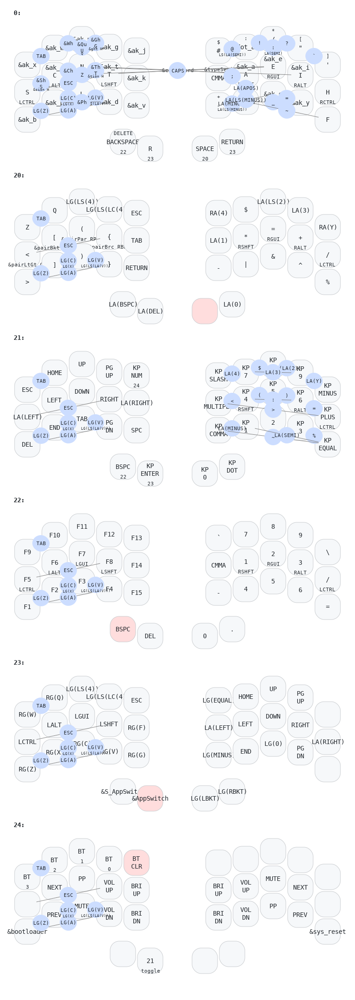

# [**Hands Down**](http://handsdownlayout.com) on [Zaphod](https://github.com/petejohanson/zaphod-config)


My personal instance of [**Hands Down**](http://handsdownlayout.com) on a [Zaphod](https://www.reddit.com/r/ErgoMechKeyboards/comments/1130oor/zaphod_in_café_society/), including all my add-on features, (using only *very customized* ZMK behaviors), no custom code.

```
     ╭─────────────────────╮ ╭──────────────────────╮
     │  X   W   M   G   J  │ │  #$  .:  /*  "[  ']  │
     │  S   C   N   T   K  | |  ,;   A   E   I   H  │
     │  B   P   L   D   V  │ │  -+   U   O   Y   F  │
     ╰──────────╮  BSP  R  │ │  SPC RET  ╭──────────╯
                ╰──────────╯ ╰───────────╯
```
[***Vibranium***](https://sites.google.com/alanreiser.com/handsdown/home/hands-down-neu#h.eyvjpfoqjy65) (a.k.a *Neu-vb*) is great with all the other [smart behaviors](https://sites.google.com/alanreiser.com/handsdown#h.8ngiif20qf4). Currently I have most of the *essential* combos (`Qu`,`Z`, `Undo`, `Cut`, `Copy`, `Paste`, etc.), *and* **`H` digraph combos** to send `TH`,`CH`,`WH`,`SH`,`GH`,`PH` bigramsr. There's a ZMK take on [***Adaptive Keys***](https://sites.google.com/alanreiser.com/handsdown#h.ps4itorhjiq9) (*using macros and sticky layers*) and [***Linger Keys***](https://sites.google.com/alanreiser.com/handsdown#h.w8doktr0rzce) (*using macros and hold-tap behaviors*). They behave a bit differently than in QMK, but are quite usable. Eventually I hope to deploy a properly coded solution to these features.

Templates for [***Neu***](https://sites.google.com/alanreiser.com/handsdown/home/hands-down-neu#h.ze4kq734zl5w) and [***Gold***](https://sites.google.com/alanreiser.com/handsdown/home/hands-down-neu#h.8i2msuo3butx) are in the works.

Currently building only for a Mac (*hard coded for gui instead of ctrl, and some mac specific keycodes*), because I use Zaphod mainly with my iPads and phone when I'm on the road. My [***Semantic Keys***](https://sites.google.com/alanreiser.com/handsdown#h.7mehnxbqcx2s) feature for platform independence works on my QMK implementations, but isn't yet fully fleshed out and will require more invasive work for ZMK, so this too is for later.

Thanks to [jcmkk3](https://github.com/jcmkk3) for the idea to implement adaptives via sticky layers, and many others on the [**Hands Down** Discord](https://discord.gg/BC3fzb2E) for the endless creativity and support. Of course, huge thanks to [Pete Johanson](https://github.com/petejohanson) *and amazing contributors like* [u/bravekarma / Caksoylar](https://github.com/caksoylar) for ZMK, and for the very sweet [Zaphod](https://github.com/petejohanson/zaphod-config) board design. 

Below is a simplified keymap, thanks to [Caksoylar](https://github.com/caksoylar)'s very useful [Keymap Drawer](https://keymap-drawer.streamlit.app/?). Missing are all the Adaptive layers (18 "ak_" layers), and more than 1/2 of the combos are removed to make this more legible (macros for pronouns, diacritics, handedness, shortcuts). Yes, it's a crowded little keyboard, but gosh, it sure is comfy!


